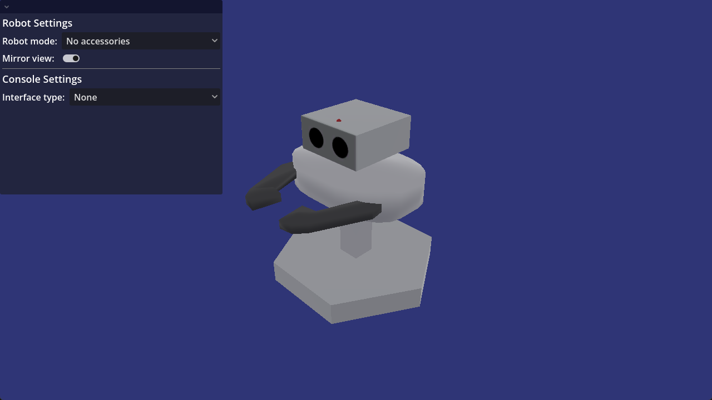
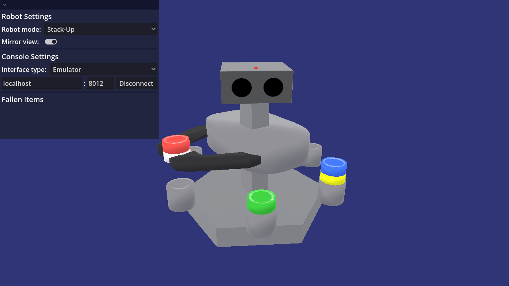
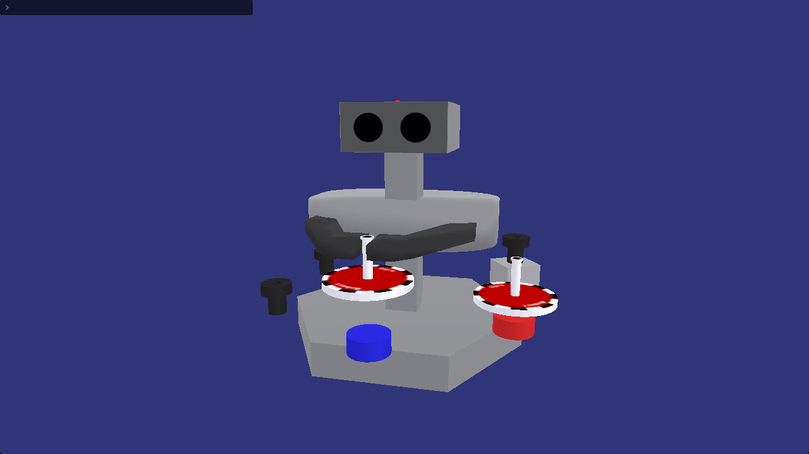
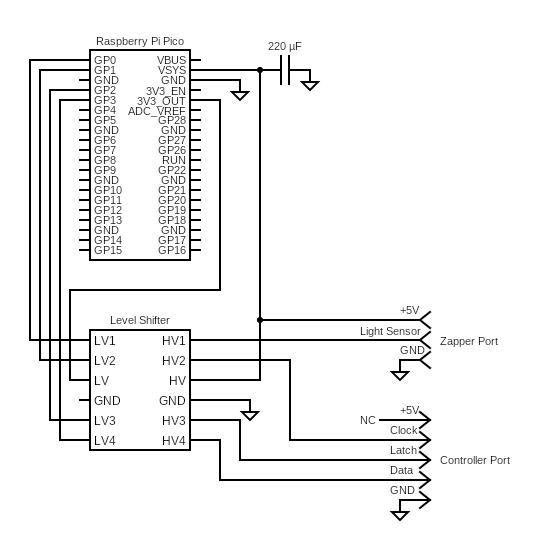
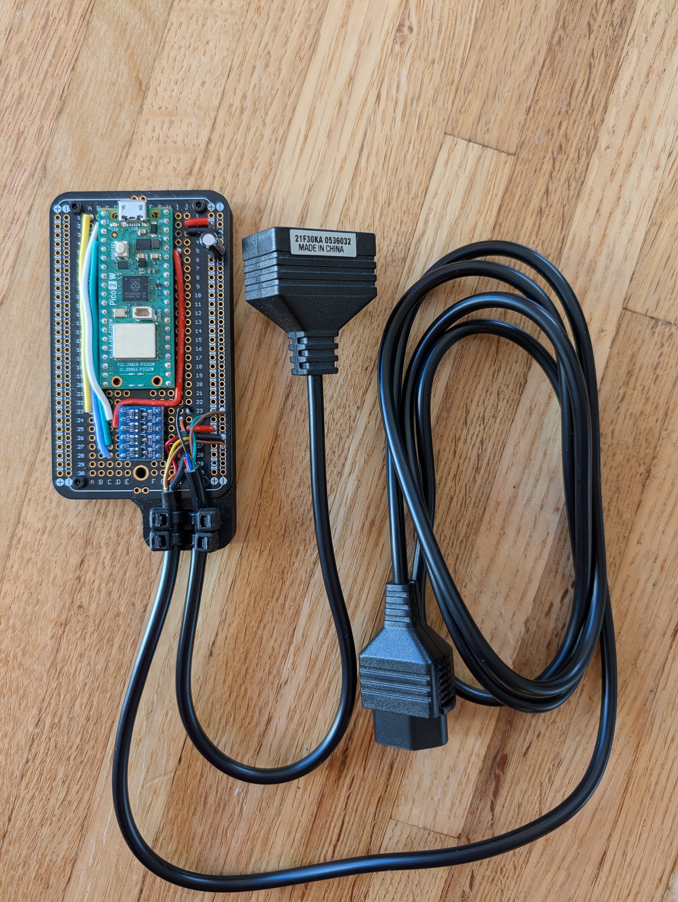

# Robert, a Nintendo R.O.B. simulator
Robert is a software-based simulation of R.O.B. (Robotic Operating Buddy), an accessory released by Nintendo in 1985 for the Nintendo Entertainment System.
Robert has all of the functionality of a real R.O.B. unit and strives to follow it in functionality as accurately as possible.

Robert is compatible with and allows you to play both Gyromite and Stack-Up. It can connect either to a real NES through use of a special hardware device, or to the emulator Mesen.

# Screenshots

# Usage
Download the Robert.zip file from the Releases page.

To use the main app, simply extract the files and run the .exe file. The app requires one of the two interfaces to be used:

### Emulator setup
Currently, only [Mesen](https://www.mesen.ca/) is supported. First, download and install it, and start running one of the games.

To connect to Robert, go to `Debug -> Scripts` to open the Script Window. 

Before running it for the first time, some settings must be changed. Select `Script -> Settings`, then in the setings window,
check both `Allow access to I/O and OS functions` and `Allow network access`. Click `OK`. This only needs to be done once.

Next, choose `File -> Open` and select the `robert-mesen.lua` file. You may now minimize the script window.

In the main Robert app, choose `Emulator` for the interface type then click `Connect`. The other settings only need to be changed if Mesen is running on a different system.

### Hardware interface assembly
This requires a special device made out of a Raspberry Pi Pico microcontroller. Here is a guide on how to assemble one.

You will need:
1. NES Zapper
2. Raspberry Pi Pico (Pico W, Pico 2, or Pico 2 W works too)
3. [3.3v to 5v bidirectional level shifter](https://www.amazon.com/HiLetgo-Channels-Converter-Bi-Directional-3-3V-5V/dp/B07F7W91LC)
4. [NES controller extension cable](https://www.amazon.com/Retro-Bit-NES-Cable-Extension-6FT/dp/B005IL1E0G)
5. 1 220μF capacitor
6. Wires 
7. (Optional) A board to assemble it on, such as a breadboard or [breaboard PCB](https://www.amazon.com/ElectroCookie-Solderable-Breadboard-Electronics-Gold-Plated/dp/B07ZYNWJ1S)

Additionally, due to using a NES Zapper, the interface will only work on a 240p CRT TV or monitor. LCDs and computer CRTS running emulators will not work.

First, cut the extension cable in half and strip the wires. You will need to use a multimeter to test for which wires go to which pins. Reference this pinout for your own use:

Next, assemble the circuit according to this diagram. Note that "Strobe" and "Latch" are actually the same pin, the terminology sometimes differs.
The Zapper should be using the female end of the cable, and the controller gets the male end.

After putting together the circuit, connect it to your computer with a USB cable while holding the BOOTSEL button on the Pico. Drag the relevant .uf2 file (found in Releases) for your board onto the USB drive that appears. 
Once it finishes, the hardware interface is ready to use.

Here is a picture of mine, for reference:

### Hardware interface usage
To use the hardware interface, you will need to connect a NES Zapper to the female controller port on the interface.
The Zapper needs to be pointed at the middle of the CRT screen. If you have a 3D printer, I suggest printing one of [these](https://www.printables.com/model/723541-nintendo-zapper-stand) to make that easier for you.
The male controller cable should be plugged into the NES's second controller port.

Connect the Pico to your computer. You will need to find the serial port number that the Pico appears as, on Windows this is COMX where X is a number. This can be found in Device manager under `Ports (COM & LPT)`.

In the main Robert app, select `Hardware` under `Interface Type`, type in the port name (e.g. `COM3`) and click Connect. 
Verify the Zapper is seeing the screen by choosing `TEST` in the main menu of either game, the robot's LED should start blinking.

---

This project was made without the use of any AI tools or assistance. All assets contanined in this repository have been made completely by me.